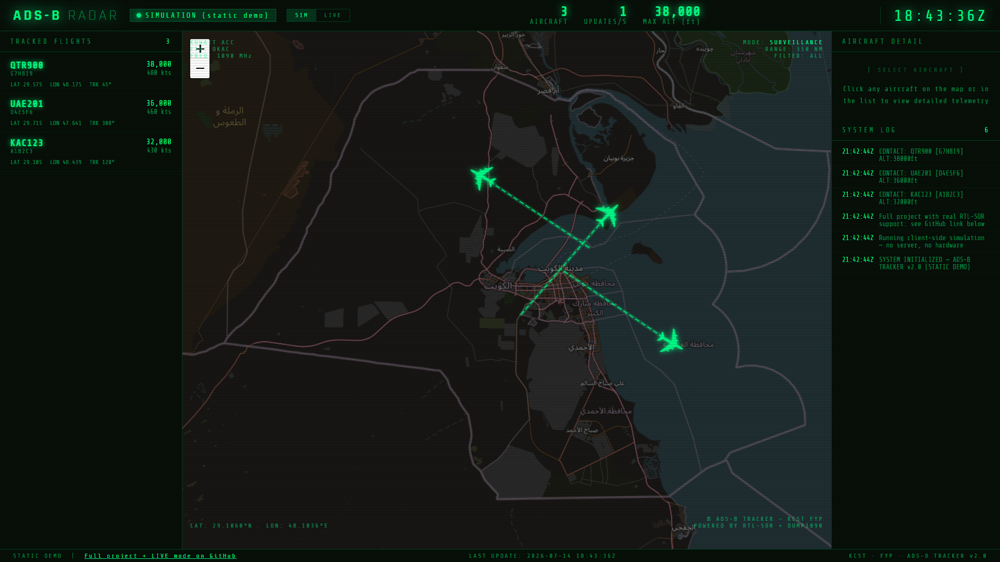

<div align="center">

# ✈️ ADS-B Flight Tracker

### Real-Time Aircraft Radar for Any RTL-SDR Dongle — Any Laptop, Any Raspberry Pi

[](https://python.org)
[](https://flask.palletsprojects.com)
[](https://www.raspberrypi.com)
[](LICENSE)
[](https://huggingface.co/spaces/engdarwish/adsb-flight-tracker)
[](https://github.com/eahmeddarwish/adsb-flight-tracker)

**Built by [Ahmed Darwish](mailto:eahmeddarwish@gmail.com)**

[🚀 Live Demo on Hugging Face](https://huggingface.co/spaces/engdarwish/adsb-flight-tracker) · [📖 Documentation](#architecture--معمارية-المشروع) · [⭐ Star on GitHub](https://github.com/eahmeddarwish/adsb-flight-tracker)

</div>

<!-- Add a real screenshot of the running dashboard here, e.g.: -->
<!--  -->

---

## 🌍 Overview | نظرة عامة

**[English]**
ADS-B Flight Tracker is a real-time aircraft radar that decodes live ADS-B transponder
signals over 1090 MHz using an RTL-SDR USB dongle and renders every aircraft on a retro
ATC-style dashboard. It runs on **any Windows, macOS, or Linux laptop** — a Raspberry Pi is
just one convenient way to leave it running as a 24/7 kiosk, not a requirement. No hardware
yet? A built-in simulation mode runs the exact same GUI with demo traffic.

**[العربية]**
متتبع رحلات ADS-B هو رادار طيران حي بيفك تشفير إشارات الطائرات الحقيقية (ADS-B) على تردد
1090 ميجاهرتز باستخدام دونجل RTL-SDR، ويعرضها على واجهة رادار كلاسيكية بطابع أبراج المراقبة
الجوية. يشتغل على **أي لابتوب** ويندوز أو ماك أو لينكس — الراسبيري باي مجرد خيار مريح
للتشغيل الدائم 24 ساعة، مش شرط. لسه معندكش هاردوير؟ فيه وضع محاكاة جاهز يشغّل نفس الواجهة
ببيانات تجريبية.

---

## ✨ Key Features | المميزات

| Feature | Details |
|---|---|
| 📡 **Live ADS-B Decoding** | RTL-SDR + dump1090 over 1090 MHz — real transponder data, not mocked |
| 🖥️ **Cross-Platform** | Pure Python backend, no Pi-specific code — Windows / macOS / Linux |
| 🛩️ **Retro ATC Radar UI** | Leaflet map, heading-accurate icons, flight trails, compass, scrolling system log |
| 🎮 **Simulation Mode** | Zero hardware needed — three demo aircraft, runs anywhere in seconds |
| 🔐 **Server-Side Enrichment** | Optional AviationStack lookup proxied through Flask — API key never reaches the browser |
| 🐳 **One-Port Deployment** | Single Flask process serves the GUI *and* the API — one container, one process to manage |
| 🔁 **Boot-Time Auto-Start** | systemd unit included for permanent Raspberry Pi kiosk installs |
| 🤗 **Hugging Face Ready** | Dockerfile ships a live public demo in simulation mode out of the box |

---

## 🏗️ Architecture | معمارية المشروع

```
                 ┌───────────────────────────┐
 RTL-SDR dongle  │   Any laptop / Pi / SBC    │
 (1090 MHz) ───► │  dump1090  ──►  server.py  │ ◄── simulate.py (no hardware / demo mode)
                 │  (Flask: API + static GUI) │
                 └─────────────┬───────────────┘
                                │  HTTP (same origin)
                                ▼
                     static/radar_gui.html
                  (Leaflet map, browser-side)
```

One Flask process (`app/server.py`) serves the static radar GUI **and** the JSON API on a
single port. `app/simulate.py` is just another client of the same `/update` endpoint, which
is what makes simulation and live modes interchangeable.

| Endpoint | Purpose | الوظيفة |
|---|---|---|
| `GET /` | Serves the radar GUI | يعرض واجهة الرادار |
| `GET /planes` | Current aircraft list (from `simulate.py`) | قائمة الطائرات الحالية (وضع المحاكاة) |
| `POST /update` | Data sources push aircraft here | نقطة استقبال بيانات الطائرات |
| `GET /live` | Proxies dump1090's live feed | يمرر بيانات dump1090 الحية |
| `GET /api/flight/<callsign>` | Server-side AviationStack lookup (key never reaches the browser) | بحث بيانات الرحلة (المفتاح على السيرفر فقط) |
| `GET /health` | Liveness/monitoring check | فحص حالة السيرفر |

---

## 🚀 Quick Start | البدء السريع

### Option 1: Hugging Face Space (No Setup) | بدون أي إعداد

Visit the live demo: **[huggingface.co/spaces/engdarwish/adsb-flight-tracker](https://huggingface.co/spaces/engdarwish/adsb-flight-tracker)**

> Runs in simulation mode — you'll see demo aircraft moving live, no hardware required.

### Option 2: Run Locally (Simulation) | تشغيل محلي (محاكاة)

```bash
git clone https://github.com/eahmeddarwish/adsb-flight-tracker.git
cd adsb-flight-tracker
python3 -m venv venv && source venv/bin/activate
pip install -r requirements.txt
cp .env.example .env               # optional: add an AviationStack key here
python3 app/start.py               # simulation mode by default
```

Open **http://localhost:5000** — three demo aircraft moving over Kuwait.

### Option 3: Live Hardware (Real Aircraft) | هاردوير حقيقي

See **[LIVE mode — on your own laptop](#-live-mode--on-your-own-laptop-windows--macos--linux-no-pi-required)** below.

---

## 🎛️ Two modes, both first-class | وضعان دائمان وليس تكرار

This project ships with **two interchangeable data sources**, on purpose:

- **Simulation** (`python3 app/start.py`) — zero hardware, works anywhere in seconds. This is
  what runs on Hugging Face and what you should use to try the GUI or develop against it.
- **Live** (`python3 app/start.py --live`) — real ADS-B traffic from an RTL-SDR dongle +
  antenna, decoded by [dump1090](https://github.com/flightaware/dump1090).

كل وضع بيتكلم مع نفس السيرفر ونفس الواجهة تمامًا — بدّل بينهم من زر SIM/LIVE في الهيدر
في أي وقت وانت شغال.

## 📡 LIVE mode — on your own laptop (Windows / macOS / Linux, no Pi required)

The Python side (`server.py`, `start.py`) has no Raspberry-Pi-specific code — it's plain
cross-platform Python. The only hardware-specific piece is getting **dump1090** talking to
your RTL-SDR dongle:

**1. Install the RTL-SDR USB driver:**
- **Windows:** install drivers with **Zadig** — follow the
  [RTL-SDR Quick Start Guide](https://www.rtl-sdr.com/rtl-sdr-quick-start-guide/), then run
  dump1090 **inside WSL2** (`wsl --install`), attaching the dongle with
  [usbipd-win](https://github.com/dorssel/usbipd-win).
- **macOS:** `brew install rtl-sdr`
- **Linux:** `sudo apt-get install librtlsdr-dev libusb-1.0-0-dev`

**2. Build and run dump1090** (Linux/macOS/WSL2):
```bash
./scripts/install-dump1090.sh
<path-printed-above>/dump1090 --net
```

**3. In another terminal, from this project:**
```bash
python3 app/start.py --live
```
`start.py` checks dump1090 is reachable and tells you clearly if it isn't yet.

Pointing at dump1090 running on a different machine (no code changes needed):
```bash
DUMP1090_URL=http://<that-machine-ip>:8080/data/aircraft.json python3 app/start.py --live
```

### Running as a permanent kiosk (Raspberry Pi) | تشغيل دائم على الراسبيري باي

Identical steps — the Pi is just a convenient always-on box. For boot-time auto-start, see
`systemd/adsb-radar.service`.

---

## ⚙️ Configuration | الإعدادات

All configuration lives in environment variables (see `.env.example`) — nothing is hardcoded:

| Variable | Default | Notes |
|---|---|---|
| `HOST` / `PORT` | `0.0.0.0` / `5000` | Where Flask listens |
| `DUMP1090_URL` | `http://127.0.0.1:8080/data/aircraft.json` | Live-mode data source |
| `AVIATIONSTACK_API_KEY` | *(empty)* | Optional. Enables the enrichment panel |
| `ALLOWED_ORIGINS` | `*` | CORS — fine for a closed LAN kiosk |
| `MAP_CENTER_LAT/LON`, `MAP_ZOOM` | Kuwait, zoom 7 | Change to your own region |

---

## 🐳 Deploying as a Hugging Face Space (Docker SDK)

The included `Dockerfile` runs the exact same app in simulation mode on port `7860`:

```bash
git remote add hf https://huggingface.co/spaces/engdarwish/adsb-flight-tracker
git push hf main
```

Set `AVIATIONSTACK_API_KEY` as a Space secret to enable the enrichment panel in the hosted demo.

---

## 📁 Project Structure | هيكل المشروع

```
.
├── app/
│   ├── server.py        # Flask API + static file server
│   ├── simulate.py      # simulated aircraft data source
│   ├── start.py         # one-command launcher (auto-detects LAN IP)
│   └── config.py        # all configuration, env-driven
├── static/
│   └── radar_gui.html   # the radar dashboard (Leaflet + vanilla JS)
├── data/
│   ├── sample_aircraft.json
│   └── wpa_supplicant.conf.example
├── systemd/
│   └── adsb-radar.service
├── scripts/
│   └── install-dump1090.sh
├── assets/               # hardware photos, icon source, screenshots
├── Dockerfile
└── requirements.txt
```

---

## 🔧 Hardware Used | الهاردوير المستخدم

- Any laptop or SBC with a USB port — Windows, macOS, or Linux (Raspberry Pi is a great
  choice for a permanent 24/7 kiosk, but the code has no Pi-specific dependency)
- RTL-SDR USB dongle tuned to 1090 MHz
- 5.5 dBi antenna (see `assets/hardware/`)

---

## 🔒 Security Notes | ملاحظات أمنية

**[English]**
- The AviationStack key is read **only** by the Flask backend — never embedded in HTML/JS.
- `data/wpa_supplicant.conf.example` is a template; the real, credential-filled file lives
  only on the device itself and is git-ignored.
- `POST /update` validates its payload shape before accepting it.

**[العربية]**
- مفتاح AviationStack بيتقرأ من السيرفر بس، ومش موجود خالص في كود الواجهة (JS/HTML).
- ملف `wpa_supplicant.conf.example` نموذج فاضي؛ الملف الحقيقي فيه باسورد الواي فاي يفضل على
  الجهاز نفسه بس ومستبعد من الـ git.

---

## 🗺️ Roadmap | خطط التطوير

- [x] **Phase 1** — Cross-platform simulation + live modes, unified Flask server, retro radar UI *(current)*
- [ ] **Phase 2** — Historical flight playback / replay mode
- [ ] **Phase 3** — Multi-receiver support (combine feeds from several RTL-SDR stations)
- [ ] **Phase 4** — Alerting (military/emergency squawk codes, geofenced airspace)
- [ ] **Phase 5** — Mobile-friendly responsive layout

---

## 👤 Author | المطور

<div align="center">

**Ahmed Darwish**

*Electrical & Computer Engineer | Python · Arduino · Raspberry Pi · AI/ML*

[](mailto:eahmeddarwish@gmail.com)
[](https://github.com/eahmeddarwish)
[](https://huggingface.co/engdarwish)

</div>

---

## 📄 License

This project is licensed under the **MIT License** — see [LICENSE](LICENSE) for details.

```
MIT License — Copyright (c) 2026 Ahmed Darwish
Free to use, modify, and distribute with attribution.
```

---

<div align="center">

⭐ **If this project helped you, please give it a star on GitHub!** ⭐

*Made with ❤️ by Ahmed Darwish*

</div>
